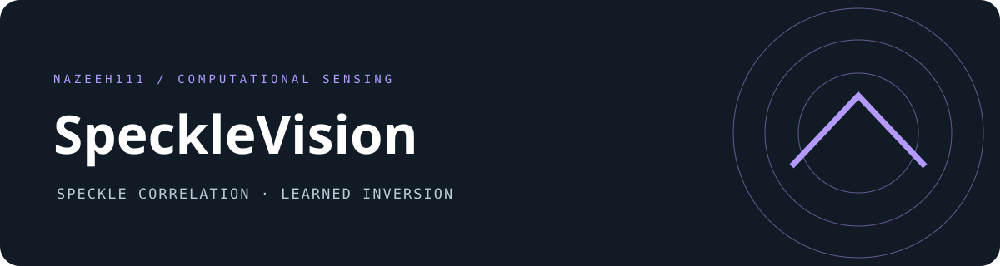

# SpeckleVision

**Development history:** Developed locally using Git before publication. These projects were published to GitHub together, so similar upload dates do not indicate when development began.

Recover hidden-scene structure from noisy speckle correlations using a convolutional network. Includes inference, training, correlation utilities, synthetic training-data generation, and sample correlation images.

## Inference

The source expects PyTorch, torchvision, matplotlib, Pillow, and an NVIDIA CUDA environment. It uses historical PyTorch APIs; current PyTorch does not provide the `torch.rfft`/`torch.irfft` functions used by the correlation utilities. Keep a compatible historical environment for full reproduction.

1. Download the [trained network](https://stanford.box.com/s/zyzdhzyk68xw6z8whpcup5cman55esl7) separately.
2. Place `TrainedNetwork.pth` in `checkpoints/`.
3. Select the input root in `demo.py` if needed; the default is `datasets/SubsampledData/`.
4. Run `python demo.py`.

The demo explicitly loads the checkpoint onto CUDA. Outputs are saved to `Reconstructions/`, with the existing crop and display conventions. The repository contains sample inputs; the checkpoint is not included. The download link was retained but its availability has not been verified.

## Training

Download [BSD-500](https://www2.eecs.berkeley.edu/Research/Projects/CS/vision/grouping/resources.html) into `datasets/BSD500`, run `create_training_data.m` in MATLAB, then run `python train_network.py`. Model architecture, normalization, training defaults, and sample data remain unchanged. [Raw speckle measurements](https://stanford.box.com/s/lta3jxsgrj49uio9v5qgko1betj8z77w) are available separately according to the dataset reference.

## Verification

See [verification](VERIFICATION.md). A randomly initialized CPU network smoke check is not trained reconstruction or an accuracy result. Trained inference needs the separate checkpoint and a compatible CUDA software environment.

Maintained by **nazeeh111**. The separately owned U-net component retains its [third-party terms](THIRD_PARTY_NOTICES.md).
